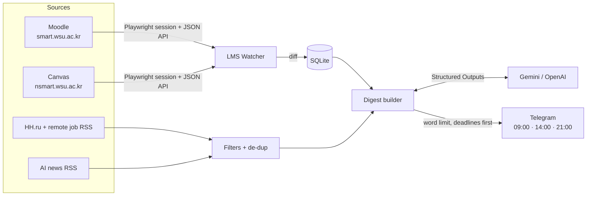

# 🤖 Personal AI Daily Assistant & LMS Watcher

**Smart Context-Aware Daily Digest & Deadline Tracker for Engineers and Students**


## 📌 Why I built this


So I built a personal assistant for myself. It logs into both portals, watches for new assignments and moved
deadlines, collects relevant jobs and AI news, and uses an LLM to compress everything into **one short Telegram
message three times a day**. Deadlines always come first. Now I don't have to open the portals unless the
assistant tells me something changed.

## 🔑 What it does

1. **LMS Automated Watcher**
   - Headless login emulation (Playwright) and silent data collection from closed portals. Several LMS instances are
     supported at once; I wrote **Moodle** and **Canvas** adapters for my university's two portals
     (`smart.wsu.ac.kr` and `nsmart.wsu.ac.kr`), and new platforms can be added as separate adapters.
   - Instead of fragile HTML scraping, I pull data from the platforms' own JSON endpoints (the Moodle AJAX web
     service and the Canvas Planner API) inside the logged-in browser session.
   - **Diff analysis:** the current state is compared against SQLite snapshots, and the assistant reacts only to
     **new assignments, moved deadlines and removed tasks**.
2. **Smart Relevance Filtering**
   - Jobs and internships (HH.ru + remote job feeds from We Work Remotely / Himalayas) with strict regex + LLM
     filtering: focused on ML, AI, Data Science, MLOps and Backend; senior, sales and unrelated roles are dropped.
   - AI news aggregation from RSS (Hugging Face, OpenAI, Google DeepMind, Habr ML) with an anti-clickbait filter and
     de-duplication, so nothing is shown twice.
3. **Strict Format & Limits (LLM Engine)**
   - All content is processed by an LLM (Gemini or OpenAI GPT-4o-mini) using **Structured Outputs (Pydantic)**.
   - A configurable word limit (default 380) is enforced by trimming low-priority blocks first.
   - **Deterministic prioritisation:** I deliberately don't let the LLM touch deadlines. They are rendered by code,
     so dates can never be hallucinated, and they always appear at the top of the message.
   - Resilience: automatic fallback to lighter models on overload (503/429) and a template mode with no LLM at all.
4. **Minimal Mental Friction**
   - Telegram delivery on a configurable schedule: 09:00 morning digest + deadlines, 14:00 midday update check,
     21:00 evening review of tomorrow's tasks. Midday/evening messages are skipped when there is nothing new.
5. **Cognitive Nudge Engine:** `/nudge <task>` breaks a daunting deadline into 5-minute micro-steps.

## 🛠 Architecture & Tech Stack

- **Language:** Python 3.11+ (asyncio)
- **Telegram interface:** aiogram 3.x
- **Scheduling:** APScheduler (cron + interval triggers) or GitHub Actions cron
- **Scraping & data fetching:** Playwright / aiohttp / feedparser / BeautifulSoup4
- **AI & structured output:** google-genai / openai + pydantic
- **Storage:** SQLite (aiosqlite) for state, LMS snapshots, diffs and de-duplication



```
app/
  __main__.py        CLI
  config.py          settings from .env, multi-LMS configuration
  models.py          domain models + Pydantic schemas for the LLM
  storage.py         SQLite state
  digest.py          collect → prioritise → LLM → HTML → word limit; /nudge
  bot.py             Telegram commands
  scheduler.py       APScheduler jobs
  llm/engine.py      Gemini / OpenAI / template fallback
  sources/           hh.py, jobs_rss.py, news.py
  lms/               base.py (Playwright sessions), moodle.py, canvas.py, diff.py, watcher.py
tests/
.github/workflows/   digest.yml (GitHub Actions deployment)
```
