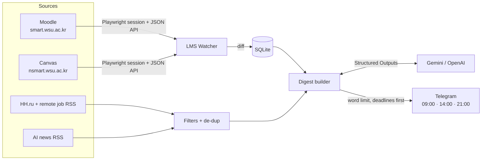

# 🤖 Personal AI Daily Assistant & LMS Watcher

**Smart Context-Aware Daily Digest & Deadline Tracker for Engineers and Students**


## 📌 Why I built this


So I built a personal assistant for myself. It logs into both portals, watches for new assignments and moved
deadlines, collects relevant jobs and AI news, and uses an LLM to compress everything into **one short Telegram
message three times a day**. Deadlines always come first. Now I don't have to open the portals unless the
assistant tells me something changed.

## 🔑 What it does

1. **LMS Automated Watcher**
   - Headless login emulation (Playwright) and silent data collection from closed portals. Several LMS instances are
     supported at once; I wrote **Moodle** and **Canvas** adapters for my university's two portals
     (`smart.wsu.ac.kr` and `nsmart.wsu.ac.kr`), and new platforms can be added as separate adapters.
   - Instead of fragile HTML scraping, I pull data from the platforms' own JSON endpoints (the Moodle AJAX web
     service and the Canvas Planner API) inside the logged-in browser session.
   - **Diff analysis:** the current state is compared against SQLite snapshots, and the assistant reacts only to
     **new assignments, moved deadlines and removed tasks**.
2. **Smart Relevance Filtering**
   - Jobs and internships (HH.ru + remote job feeds from We Work Remotely / Himalayas) with strict regex + LLM
     filtering: focused on ML, AI, Data Science, MLOps and Backend; senior, sales and unrelated roles are dropped.
   - AI news aggregation from RSS (Hugging Face, OpenAI, Google DeepMind, Habr ML) with an anti-clickbait filter and
     de-duplication, so nothing is shown twice.
3. **Strict Format & Limits (LLM Engine)**
   - All content is processed by an LLM (Gemini or OpenAI GPT-4o-mini) using **Structured Outputs (Pydantic)**.
   - A configurable word limit (default 380) is enforced by trimming low-priority blocks first.
   - **Deterministic prioritisation:** I deliberately don't let the LLM touch deadlines. They are rendered by code,
     so dates can never be hallucinated, and they always appear at the top of the message.
   - Resilience: automatic fallback to lighter models on overload (503/429) and a template mode with no LLM at all.
4. **Minimal Mental Friction**
   - Telegram delivery on a configurable schedule: 09:00 morning digest + deadlines, 14:00 midday update check,
     21:00 evening review of tomorrow's tasks. Midday/evening messages are skipped when there is nothing new.
5. **Cognitive Nudge Engine:** `/nudge <task>` breaks a daunting deadline into 5-minute micro-steps.

## 🛠 Architecture & Tech Stack

- **Language:** Python 3.11+ (asyncio)
- **Telegram interface:** aiogram 3.x
- **Scheduling:** APScheduler (cron + interval triggers) or GitHub Actions cron
- **Scraping & data fetching:** Playwright / aiohttp / feedparser / BeautifulSoup4
- **AI & structured output:** google-genai / openai + pydantic
- **Storage:** SQLite (aiosqlite) for state, LMS snapshots, diffs and de-duplication



```
app/
  __main__.py        CLI
  config.py          settings from .env, multi-LMS configuration
  models.py          domain models + Pydantic schemas for the LLM
  storage.py         SQLite state
  digest.py          collect → prioritise → LLM → HTML → word limit; /nudge
  bot.py             Telegram commands
  scheduler.py       APScheduler jobs
  llm/engine.py      Gemini / OpenAI / template fallback
  sources/           hh.py, jobs_rss.py, news.py
  lms/               base.py (Playwright sessions), moodle.py, canvas.py, diff.py, watcher.py
tests/
.github/workflows/   digest.yml (GitHub Actions deployment)
```

## 🚀 Quick Start

```bash
git clone https://github.com/askarbekkk/ai-daily-assistant.git
cd ai-daily-assistant
python -m venv .venv
# Windows: .\.venv\Scripts\activate    Linux/macOS: source .venv/bin/activate
pip install -r requirements.txt
playwright install chromium
cp .env.example .env        # then fill in .env (Windows: copy .env.example .env)
```

### 1. Try it without any keys
```bash
python -m app digest morning --dry-run
```
Prints a real digest (jobs + news) to the console. No LLM is required (`LLM_PROVIDER=none` uses template mode).

### 2. LLM
In `.env`: `LLM_PROVIDER=gemini` + `GEMINI_API_KEY=...` **or** `LLM_PROVIDER=openai` + `OPENAI_API_KEY=...`
(Gemini has a free tier: https://aistudio.google.com/apikey).

### 3. Telegram
1. Create a bot with [@BotFather](https://t.me/BotFather) and put the token into `TELEGRAM_BOT_TOKEN`.
2. Run `python -m app run` and send `/start` to the bot. It replies with your chat id; put it into `TELEGRAM_CHAT_ID`.
3. Restart `python -m app run`. Set `TIMEZONE` (e.g. `Asia/Seoul`).

### 4. LMS (Moodle + Canvas)
Log in once by hand in a real browser; the session is saved to `data/lms_<name>.json`:
```bash
python -m app lms-login smart     # a browser window opens, log in as usual
python -m app lms-login nsmart
python -m app lms-check           # poll the portals and list upcoming tasks
```
When a session expires, the bot sends a reminder. For unattended re-login, fill in `LMS_<NAME>_USERNAME` /
`LMS_<NAME>_PASSWORD` in `.env` (form selectors are pre-configured; for another portal, find them with
`python -m app lms-probe <name>`). For Canvas you can also use an API token via `LMS_NSMART_TOKEN`.

> The first LMS poll only builds a baseline snapshot; "new assignment" notifications start from the second poll.

### 5. HH.ru (optional)
Since April 2026 the HH.ru API returns 403 without an application token. Register an app at https://dev.hh.ru and set
`HH_APP_TOKEN`. Without a token HH.ru is skipped and jobs come from the remote job feeds (`JOB_FEEDS`).

## ☁️ Deployment: GitHub Actions (24/7, no server)

I didn't want the assistant to depend on my laptop being on, so it runs on GitHub Actions. The workflow [`.github/workflows/digest.yml`](.github/workflows/digest.yml) runs on cron three times a day
(08:50 / 13:50 / 20:50 KST, offset for GitHub's scheduling delay). It polls the LMS portals, builds the digest and
sends it to Telegram.

- **State between runs** (SQLite + LMS sessions) is kept in the Actions cache **only as an AES-256 encrypted archive**
  (key in the `STATE_KEY` secret), which makes it safe to keep the repository public.
- **Secrets** (Settings → Secrets and variables → Actions): `TELEGRAM_BOT_TOKEN`, `TELEGRAM_CHAT_ID`,
  `GEMINI_API_KEY` (or `OPENAI_API_KEY`), `LMS_SMART_USERNAME/PASSWORD`, `LMS_NSMART_USERNAME/PASSWORD`, `STATE_KEY`;
  optional: `HH_APP_TOKEN`, `LMS_NSMART_TOKEN`.
- Manual run: Actions → *Daily digest* → *Run workflow*.
- In this mode the bot only sends digests; interactive commands (`/nudge`, `/deadlines`) need a long-running
  `python -m app run` process (e.g. on a VPS).

## 💬 Commands

| Telegram | CLI | Description |
|---|---|---|
| `/digest [morning\|midday\|evening]` | `python -m app digest <slot\|auto> [--dry-run] [--refresh-lms] [--skip-empty]` | Digest right now |
| `/deadlines` | — | Deadlines for the next 7 days |
| `/nudge <task>` | `python -m app nudge "<task>"` | 5-minute micro-steps |
| `/lms` | — | LMS watcher status |
| `/check` | `python -m app lms-check` | Poll the LMS portals now |
| — | `python -m app run` | Bot + scheduler |

Tests: `pytest`

## 🗺 Roadmap

It started as a tool for myself, but the plan is to grow it step by step:

- [x] **v1.0 (MVP):** job parser (HH.ru + remote RSS), AI news RSS feeds, LLM digest generator, scheduled delivery
  to Telegram.
- [x] **v1.1 (LMS Watcher):** automatic login to university portals (Moodle + Canvas, several at once) and
  assignment state diffing.
- [x] **v1.2 (Cognitive Nudge Engine):** breaking complex deadlines into 5-minute micro-steps.
- [ ] **v2.0 (Multi-user / SaaS):** encrypted per-user sessions, more university platforms, subscription model.

## 🔒 Security

- `.env` (keys, passwords) and `data/` (session cookies, database) are excluded from git.
- In GitHub Actions, credentials live in encrypted repository secrets, and persisted state is AES-256 encrypted
  before it is cached.
- Locally, LMS sessions are stored in plain text under `data/`; never publish that folder.
- The assistant is **read-only**: it never submits, edits or clicks anything in the LMS, it only reads assignments
  and due dates.
